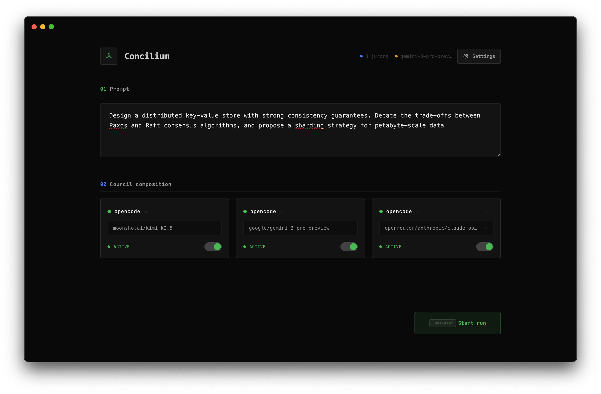

# Concilium

> Every model gives you a different answer. Get the right one.

Concilium is a multi-LLM deliberation platform that runs multiple AI coding agents in parallel, has them peer-review each other's responses anonymously, and synthesizes a single superior answer — all in one desktop application.

[](https://opensource.org/licenses/MIT)
[](https://github.com/matiasdaloia/concilium)
[](https://github.com/matiasdaloia/concilium)



## The Problem

You already know one model isn't enough. So you open multiple terminals, paste the same prompt into Claude, OpenAI, and Codex, then spend 20 minutes reading and comparing their outputs. There has to be a better way.

**The old workflow:**
- Copy-paste the same prompt into 3 different tools
- Switch between browser tabs, terminals, and apps
- Read 3 long outputs and compare them manually
- Hope you picked the answer with the fewest bugs

**~25 minutes per prompt. High cognitive load. Error-prone.**

## The Solution

Concilium automates the entire process:

1. **Parallel Execution** — Send one prompt, three agents start working simultaneously
2. **Blind Peer Review** — Juror models evaluate and rank responses anonymously
3. **Synthesis** — A Chairman model combines the best parts into one validated answer

**~3 minutes per prompt. Fully automated. Peer-validated.**

## Features

- **Multi-Agent Execution** — Run Claude, OpenAI, and local models in parallel
- **Anonymous Peer Review** — Models critique each other without bias
- **Consensus-Based Ranking** — Objective scoring filters out hallucinations
- **Synthesized Output** — One answer that captures the best of all three
- **Local-First** — Your data stays on your machine
- **Single Interface** — No more tab switching or terminal juggling
- **Open Source** — MIT licensed, fully transparent

## Getting Started

Concilium is open source and ready to build. Clone the repo, configure your environment, and build the app.

### Prerequisites

- Node.js 18+
- macOS 12+ (Apple Silicon or Intel) or Linux
- At least one CLI agent installed:
  - [Claude Code](https://docs.anthropic.com/en/docs/agents-and-tools/claude-code/overview)
  - [Codex](https://github.com/openai/codex) (OpenAI)
  - [OpenCode](https://github.com/sst/opencode) or similar

### 1. Clone the repository

```bash
git clone https://github.com/matiasdaloia/concilium.git
```

### 2. Configure environment

Create a `.env` file in the `desktop` directory with your OpenRouter API key:

```bash
cd concilium/desktop
echo "OPENROUTER_API_KEY=sk-or-..." > .env
```

### 3. Install & Build

```bash
npm install
npm run build
```

This will install dependencies and package the application into the `out/` directory.

### 4. Run from anywhere

Link the CLI to your PATH:

```bash
npm link
```

Then open Concilium from any project directory:

```bash
cd ~/my-project
concilium              # uses current directory
concilium ./backend    # or specify a path
```

The GUI opens with all agents running in your target directory.

> **Manual launch:** You can also run the built executable directly from `out/Concilium-darwin-arm64/Concilium.app` (macOS) or `./out/Concilium-linux-x64/concilium` (Linux).

## Architecture

Concilium uses a three-stage consensus protocol:

```
┌─────────────────┐     ┌─────────────────┐     ┌─────────────────┐
│  Stage 1:       │     │  Stage 2:       │     │  Stage 3:       │
│  Parallel       │ ──► │  Blind          │ ──► │  Synthesis      │
│  Execution      │     │  Review         │     │                 │
└─────────────────┘     └─────────────────┘     └─────────────────┘
        │                       │                       │
        ▼                       ▼                       ▼
   ┌─────────┐            ┌─────────┐            ┌─────────┐
   │ Claude  │            │ Juror 1 │            │         │
   │ OpenAI   │            │ Juror 2 │            │ Chairman│
   │ OpenCode│            │ Juror N │            │         │
   └─────────┘            └─────────┘            └─────────┘
        │                       │                       │
        └───────────────────────┴───────────────────────┘
                              │
                              ▼
                    ┌─────────────────┐
                    │  Final Answer   │
                    │  (Validated)    │
                    └─────────────────┘
```

## Repository Structure

```
llm-council/
├── desktop/          # Electron desktop application
│   ├── src/
│   │   ├── main/     # Main process (Node.js)
│   │   ├── preload/  # Preload scripts
│   │   └── renderer/ # React frontend
│   └── package.json
├── website/          # Astro marketing website
│   ├── src/
│   │   ├── sections/ # Page sections
│   │   ├── islands/  # Interactive React components
│   │   └── layouts/  # Page layouts
│   └── package.json
└── assets/           # Shared assets (logos, icons)
```

## Voice Dictation

Concilium includes offline voice dictation powered by [Whisper](https://github.com/openai/whisper). Speak your prompts instead of typing them.

### Setup

Voice dictation requires a one-time setup to download the Whisper model and build the binary:

```bash
cd desktop

# Download the Whisper model (~150MB)
npx nodejs-whisper download

# Build whisper.cpp
cd node_modules/nodejs-whisper/cpp/whisper.cpp
cmake -B build -DGGML_CUDA=OFF
cmake --build build --config Release
```

### Requirements

- **ffmpeg** (recommended): For audio format conversion
  ```bash
  # macOS
  brew install ffmpeg
  
  # Ubuntu/Debian
  sudo apt install ffmpeg
  ```

### Usage

1. Click the **Dictate** button next to the prompt input
2. Speak your prompt
3. Click **Stop** when finished
4. Wait 2-3 seconds for transcription
5. Your text appears in the prompt field

Voice dictation runs **completely offline** — your audio never leaves your machine.

## Development

### Desktop App

```bash
cd desktop
npm install
npm run start        # Start development server
npm link             # Make `concilium` available globally
concilium .          # Launch Concilium in current dir (dev mode)
npm run package      # Package the app
npm run make         # Create distributables
npm run test         # Run tests
```

### Website

```bash
cd website
npm install
npm run dev          # Start development server
npm run build        # Build for production
npm run preview      # Preview production build
```

## Contributing

We welcome contributions! Please see our [Contributing Guide](CONTRIBUTING.md) for details.

1. Fork the repository
2. Create your feature branch (`git checkout -b feature/amazing-feature`)
3. Commit your changes (`git commit -m 'Add some amazing feature'`)
4. Push to the branch (`git push origin feature/amazing-feature`)
5. Open a Pull Request

## License

This project is licensed under the MIT License — see the [LICENSE](LICENSE) file for details.

## Acknowledgments

- Built with [Electron](https://www.electronjs.org/), [React](https://react.dev/), and [TypeScript](https://www.typescriptlang.org/)
- Website powered by [Astro](https://astro.build/) and [Tailwind CSS](https://tailwindcss.com/)
- 3D visuals using [React Three Fiber](https://docs.pmnd.rs/react-three-fiber)

---

<p align="center">
  Made with ❤️ by <a href="https://github.com/matiasdaloia">Matias Daloia</a>
</p>
